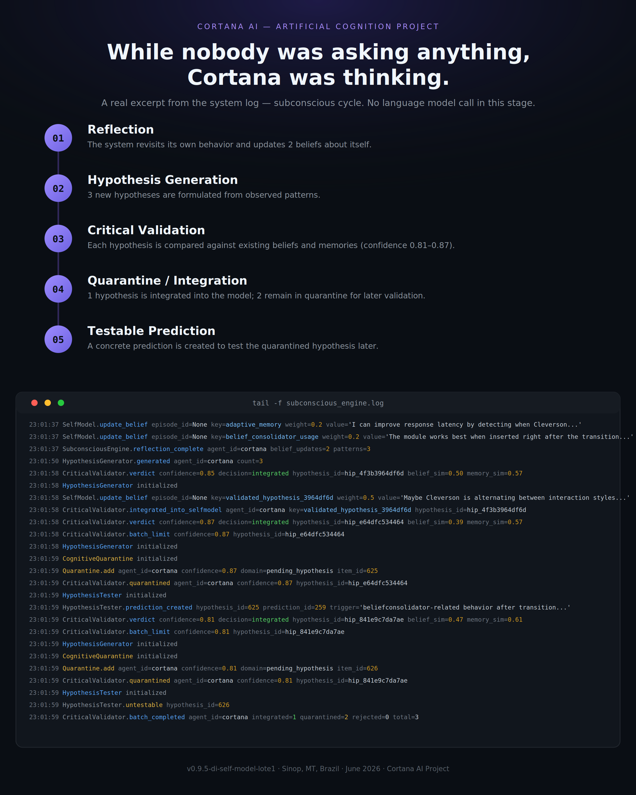

# Evidence #001

## Subconscious Cognitive Cycle

**Date:** June 2026

---

### Context

The image above is not a conceptual mockup.

It is a real excerpt captured during normal operation of the Persistent Intelligence Project while no user interaction was taking place.

At the time of capture, no conversation was active and no requests were being processed.

---

### What Happened

During an internal subconscious cycle, the system:

1. Revisited previously stored beliefs.
2. Generated new hypotheses from observed patterns.
3. Performed critical validation against existing memory structures.
4. Integrated validated knowledge.
5. Placed uncertain hypotheses into cognitive quarantine.
6. Generated a testable prediction for future validation.

---

### Why This Evidence Matters

Most AI systems perform reasoning only while actively responding to a user.

This evidence demonstrates cognitive activity occurring during periods of inactivity.

The observed behavior was generated by internal cognitive systems operating independently of active conversation processing.

No external language model calls were involved during the sequence shown in this excerpt.

---

### Research Significance

This evidence does not demonstrate consciousness, sentience, or autonomous agency.

However, it provides direct evidence of:

- Persistent memory maintenance
- Hypothesis generation
- Critical validation
- Cognitive quarantine
- Internal reflection processes

These mechanisms form part of the project's broader investigation into persistent cognitive architectures.

---

### Related Documents

- Observation #003
- Milestone #001
- Milestone #002

---

Persistent Intelligence Project

Exploring memory, continuity, learning, identity, and long-term human-AI interaction.
